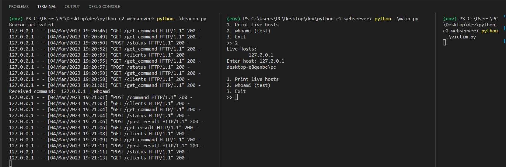

# Python C2 Server using HTTP & API Endpoints 
A basic Python-based Command & Control (C2) server using HTTP & API Endpoints with a beacon to route traffic between victim and operator. 

Do note that this is not meant to be a usable C2 server, and should definitely not be used for actual red team engagements. This is a PoC to to understand a Command & Control Framework. 

The project aims to showcase the communication and control mechanisms involved in a C2 framework.


## Features

- C2 comms exchanged over HTTP traffic (kind of stealthy)
- Uses API Endpoints to control victim
- Beacon to route traffic between victim and operator





## Usage
- Run beacon.py on random server (e.g. AWS EC2)
- Run main.py on operator machine
- Run victim.py on victim machine


## API
API calls are handled by the beacon
- ```POST /status```

| Description                        |
| :-------------------------         |
| Updates beacon on status of clients |

- ```GET /clients```

| Description                        |
| :-------------------------         |
| Returns the status of clients |

- ```POST /command```

| Parameter | Type     | Description                       |
| :-------- | :------- | :-------------------------------- |
| `command`      | `string` | Sends command to be executed by the victim  |

- ```GET /get_command```

| Description                        |
| :-------------------------         |
| Retrieves the latest command to be executed by the victim |

- ```POST /post_result```

| Parameter | Type     | Description                       |
| :-------- | :------- | :-------------------------------- |
| `result`  | `string` | Sends the result of the command executed by the victim  |

- ```GET /get_result```

| Parameter | Type     | Description                       |
| :-------- | :------- | :-------------------------------- |
| `result`  | `string` | Retrieves the result of the latest command executed by victim  |


## TODO / Notes
- API Endpoints are incomplete, you can add/remove/edit the existing endpoints to suit your needs
- Only the `whoami` command is implemented for now, more commands can be added in `victim.py`
- More commands can be implemented if required, these scripts serve as an outline
- The beacon should be modified to use HTTPS instead of HTTP if you want to be stealthier
- HTTP traffic is very noisy and can be easily detected by IDS/IPS
- Script flow is heavily dependant on the order of execution, e.g. `main.py` must be executed before `victim.py`
- The victim must have Python and all its dependencies installed (lol)

